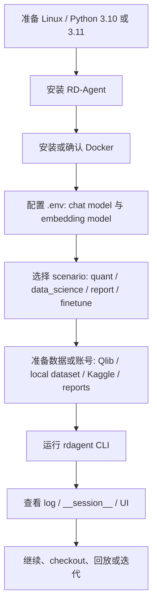

# RD-Agent 项目定位与使用说明

## 一句话定位

【事实】RD-Agent 是一个面向 data-driven R&D 的开源 agent framework，围绕 hypothesis proposal、code implementation、experiment execution、feedback learning 组织多场景自动研发流程。

## 一段话理解

【事实】官方把 RD-Agent 描述为自动化工业 R&D 高价值环节的工具，先聚焦数据和模型相关场景。它的核心思想是 `R` 负责提出研究想法或 hypothesis，`D` 负责把想法实现成可运行代码，随后通过真实或近似真实的实验反馈继续迭代。Quant finance 是它的重点应用之一，但项目本身还覆盖 Kaggle / data science、paper-to-model、report-to-factor、LLM fine-tuning 和 UI trace viewer。

## 操作者、模型接入和 runtime

【事实】RD-Agent 不是 Codex 调 MCP，也不是某个固定模型。它是项目内部自带的 agent workflow runtime。

这里的 `runtime` 可以简单理解为：**程序真正跑起来以后，负责调度步骤、保存状态、调用模型、执行代码和进入下一轮的运行底座**。如果说 prompt/rules 是“说明书”，runtime 就是“按说明书把流程实际跑起来的机器”。

| 问题 | 回答 |
| --- | --- |
| 谁是外部操作者？ | 人类用户，或者像 Codex 这样的外部助手，负责安装、配置、选择命令、决定是否继续。 |
| 谁是项目内主操作者？ | RD-Agent 自己的 `RDLoop`。命令启动后，它编排 hypothesis generation、experiment generation、coding、running、feedback 和 record。 |
| 接入的是什么模型？ | 通过 LiteLLM 接 chat model 和 embedding model。示例包括 `gpt-4o`、`gpt-4-turbo`、`deepseek/deepseek-chat`、Azure deployment、SiliconFlow embedding 等。 |
| 它是不是 MCP 工具箱？ | 不是。它主要调用项目内部 Python modules，并使用 Docker/Conda/Qlib/Kaggle/local dataset 等执行和评估环境。 |
| 它的本质是什么？ | LLM + 固定研发 workflow loop + 场景化技能模块 + 可执行实验环境。 |

【推断】和 QuantGPT 的关键差别是：QuantGPT 更像“Codex 作为外部 agent 调 MCP 工具和本地回测系统”；RD-Agent 更像“项目自己内置一个 R&D agent runtime，然后外接 LLM backend 和实验环境”。

## 作者意图

| 维度 | 内容 |
| --- | --- |
| 作者想解决的问题 | 【事实】让 AI agent 自动完成数据、模型、feature/factor、benchmark 相关研发中的提案、实现、验证和迭代。 |
| 作者方法论 | 【事实】Research 提 hypothesis，Development 写代码并执行，反馈进入下一轮。 |
| 目标用户 | 【推断】ML / data science / quant research / agent research 用户，而不是普通终端投资者。 |
| 当前成熟度 | 【事实】`pyproject.toml` classifier 标记为 `Development Status :: 3 - Alpha`；README 有 benchmark 和论文 claim，但这不等同于生产成熟。 |

## 作者推荐流程

## 官方资料地图

| 资料 | 类型 | 关键主张 | 本研究用途 | 待验证点 | 优先级 |
| --- | --- | --- | --- | --- | --- |
| `README.md` | official docs | RD-Agent 是 data-driven R&D agent；支持 quant、data science、Kaggle、paper/report copilot、finetune；Linux only。 | 总入口、使用路径、成本边界。 | benchmark claim 和真实运行体验。 | P0 |
| `docs/index.rst` | official docs | 文档目录覆盖 introduction、installation、scenario、framework、UI、research、development、API、policy。 | 建立阅读地图。 | 文档是否与代码同步。 | P0 |
| `docs/installation_and_configuration.rst` | official docs | 需要 Docker；默认 LiteLLM；需 chat 和 embedding 配置；支持 OpenAI/Azure/DeepSeek/SiliconFlow 等。 | 安全预检和付费边界。 | 哪些命令可无密钥运行。 | P0 |
| `docs/scens/quant_agent_fin.rst` | official docs | RD-Agent(Q) 做 factor-model co-optimization，运行 `rdagent fin_quant`。 | Quant 主线理解。 | Qlib 数据下载、运行成本、validation 强度。 | P0 |
| `docs/scens/data_agent_fin.rst` | official docs | `fin_factor` 做 hypothesis -> factor -> implementation -> Qlib backtest -> feedback。 | factor workflow。 | 是否强制 OOS / rolling。 | P0 |
| `docs/scens/model_agent_fin.rst` | official docs | `fin_model` 做 hypothesis -> model -> implementation -> Qlib backtest -> feedback。 | model workflow。 | 评价指标和实验复现。 | P1 |
| `docs/scens/data_science.rst` | official docs | 支持 custom dataset 和 Kaggle；Kaggle 需要账号/token/competition join。 | 非 quant workflow 和账号风险。 | 数据下载、Docker build、Kaggle side effects。 | P1 |
| `docs/project_framework_introduction.rst` | official docs | 框架以 hypothesis、experiment、feedback 为核心。 | 项目方法论。 | 代码是否强制执行该流程。 | P0 |
| `docs/ui.rst` | official docs | UI 用于查看 R&D process logs。 | 可审计性入口。 | UI 能否完整展示决策和失败。 | P1 |
| `docs/research/benchmark.rst` | official docs | RD2Bench / factor benchmark 可评估 development capability。 | benchmark 线索。 | 运行耗时和依赖。 | P2 |
| `pyproject.toml` | code / metadata | CLI entrypoint 为 `rdagent.app.cli:app`，Python `>=3.10`，Alpha。 | 安装和成熟度判断。 | PyPI 包与源码一致性。 | P0 |
| `.env.example` | code / config | 包含 OpenAI / LiteLLM proxy / embedding provider key 示例。 | 密钥和付费要求识别。 | 是否存在无 key demo。 | P0 |

## 文件夹结构

| 路径 | 作用 | 初学者怎么读 |
| --- | --- | --- |
| `README.md` | 官方首页、quick start、scenario、paper、disclaimer。 | 第一读，只建立项目定位和运行成本。 |
| `docs/` | Sphinx 官方文档。 | 第二读，重点看 installation、scens、framework、UI。 |
| `rdagent/app/` | CLI 应用入口和各场景 loop。 | 看 `cli.py` 和目标 scenario 入口即可。 |
| `rdagent/core/` | Hypothesis、Experiment、Workspace、Scenario、Feedback 等核心抽象。 | 用来理解对象模型，不需要逐包深挖。 |
| `rdagent/components/` | agent、coder、proposal、workflow、runner、knowledge management 等可复用组件。 | Phase 5 架构回读再读。 |
| `rdagent/scenarios/` | 场景实现：qlib、data_science、kaggle、finetune、general_model、rl。 | 根据目标场景选读。 |
| `rdagent/log/` | 日志、UI、trace、server。 | 运行后用于审计和回放。 |
| `web/` | 新 web frontend。 | 只在要看 Web UI 时读。 |
| `test/` | 测试和场景样例。 | 用于找最小可运行路径和离线检查。 |
| `requirements*.txt` | 依赖。 | 用于判断安装成本和外部服务。 |
| `.env.example` | 环境变量模板。 | 只参考，不要直接填真实 key。 |
| `git_ignore_folder/` | 官方文档中常见的本地产物目录。 | 运行后存 workspace、数据、reports、static 等。 |

## 功能地图

| 功能 / command / workflow | 解决什么问题 | 输入 | 输出 | 依赖 | 成熟度 |
| --- | --- | --- | --- | --- | --- |
| `rdagent fin_quant` | Quant factor-model joint evolution。 | LLM config、Qlib 数据、Docker/环境。 | factor/model 实验、日志、feedback。 | LLM API、Qlib、Docker、Linux。 | 【待验证假设】重点场景但运行成本高。 |
| `rdagent fin_factor` | 自动提出并实现 financial factors。 | hypothesis context、Qlib 数据、base features。 | factor code、Qlib backtest、feedback。 | LLM API、Qlib、Docker/Conda。 | 【事实】官方完整描述流程。 |
| `rdagent fin_model` | 自动提出并实现 quant model。 | Alpha158 subset、Qlib config。 | model code、backtest result、feedback。 | LLM API、Qlib、可能 GPU。 | 【事实】官方完整描述流程。 |
| `rdagent fin_factor_report` | 从 financial reports 抽取并实现 factor。 | report folder。 | hypothesis、factor experiment。 | LLM API、PDF/Document reader、Qlib。 | 【待验证假设】更像 copilot。 |
| `rdagent general_model <paper>` | 从论文/报告抽取模型并实现。 | paper URL 或 file。 | model implementation。 | LLM API、文档读取、执行环境。 | 【待验证假设】copilot 型。 |
| `rdagent data_science --competition` | 自动 feature engineering / model tuning。 | custom dataset 或 Kaggle competition。 | submission、score、logs。 | LLM API、Docker、数据、可能 Kaggle token。 | 【事实】官方文档详细。 |
| `rdagent llm_finetune` | benchmark-driven LLM fine-tuning。 | base model、benchmark、dataset。 | fine-tune artifacts、eval。 | GPU/模型/数据/Docker 可能较重。 | 【待验证假设】高成本场景。 |
| `rdagent ui` | 查看 run logs。 | log path。 | Streamlit UI。 | streamlit、本地端口。 | 【事实】官方文档说明。 |
| `rdagent server_ui` | Flask 后端 + web frontend。 | built static assets。 | real-time UI。 | npm build、Flask、本地端口。 | 【事实】README 说明不支持 data_science。 |
| `rdagent health_check` | 检查环境、Docker、端口。 | flags。 | health report。 | 默认会检查 env 和 Docker。 | 【建议】作为第一阶段安全模拟入口。 |

## 关键功能如何工作

| 功能 | 大概流程 | 关键模块 / 文件 | 需要后续验证 |
| --- | --- | --- | --- |
| R&D loop | propose hypothesis -> convert to experiment -> code -> run -> feedback -> record trace。 | `rdagent/components/workflow/rd_loop.py`、`rdagent/utils/workflow/loop.py`。 | 每一步失败如何落盘、是否可恢复。 |
| Quant factor/model | 生成 hypothesis 和任务，写 factor/model code，放入 Qlib template 跑 backtest。 | `rdagent/app/qlib_rd_loop/*.py`、`rdagent/scenarios/qlib/*`。 | 评价指标、OOS 严格程度、数据准备。 |
| Workspace | 为每个任务创建文件型 workspace，注入代码并执行。 | `rdagent/core/experiment.py`。 | 生成文件如何完整追踪。 |
| Session / trace | 每个 step 后 dump session，可从 path load/checkout。 | `rdagent/utils/workflow/loop.py`。 | UI 是否展示全部 decision / failure。 |
| UI | 读取 log path，展示 loop 和 evolving steps。 | `docs/ui.rst`、`rdagent/log/`、`web/`。 | 真实可审计性和易用性。 |

## 核心工作流拆解

| 阶段 | 用户看到的动作 | 系统内部动作 | 审计重点 |
| --- | --- | --- | --- |
| 选择场景 | 决定运行 quant、data science 或 copilot。 | CLI 加载对应 loop 和 settings。 | 是否需要账号、付费 API、数据下载。 |
| 配置环境 | 写 `.env`、准备 Docker、准备数据。 | Pydantic settings 从 env 读取。 | 是否含密钥和外部上传。 |
| 提出 hypothesis | Agent 生成研究想法。 | `HypothesisGen.gen(trace, plan)`。 | hypothesis 是否被保存、是否可人为审核。 |
| 生成 experiment | 将 hypothesis 转为 task / experiment。 | `Hypothesis2Experiment.convert(...)`。 | 是否能追溯输入和 prompt。 |
| 代码实现 | coder 修改 workspace。 | Developer / CoSTEER / workspace 注入文件。 | 生成文件、删除文件、失败原因。 |
| 执行与评价 | runner 执行 Qlib / dataset / benchmark。 | runner 写 result，summarizer 生成 feedback。 | 数据切分、指标、OOS、失败日志。 |
| 记录与迭代 | trace/session/log 写入。 | `record` 同步 hist 和 dag parent，loop dump。 | run id、session path、可回放性。 |

## 产物、日志和状态

| 产物 | 默认位置 / 线索 | 说明 |
| --- | --- | --- |
| 运行日志 | `log/<timestamp>/` | `LOG_SETTINGS.trace_path` 默认指向当前目录下 `log/时间戳`。 |
| session dump | `log/<timestamp>/__session__/loop/step_name` | 每个 step 成功后 pickle dump，可 load/checkout。 |
| workspace | `git_ignore_folder/RD-Agent_workspace/<uuid>` | 文件型 task workspace，注入代码和数据。 |
| prompt/cache | `prompt_cache.db`、`pickle_cache/` | 默认配置中可见 cache 路径。 |
| UI static | `git_ignore_folder/static` | `server_ui` 默认前端静态文件位置。 |
| scenario data | `git_ignore_folder/reports`、`ds_data`、Qlib data path | 不同 scenario 自行要求。 |

## 配置与依赖清单

| 类别 | 要求 | 来源 | 风险 |
| --- | --- | --- | --- |
| OS | Linux only。 | README | macOS 本机不适合直接跑完整 demo。 |
| Python | `>=3.10`，官方说 3.10/3.11 CI well-tested。 | README、`pyproject.toml` | Python 3.12 可能有兼容风险。 |
| Docker | most scenarios 需要 Docker，且当前用户无需 sudo。 | installation docs | 会 build/pull/run 容器。 |
| LLM chat | `CHAT_MODEL` 和 provider key。 | README、`.env.example` | 付费 API / 数据发送。 |
| Embedding | `EMBEDDING_MODEL`，可能是 OpenAI/Azure/SiliconFlow 等。 | installation docs | 付费 API / 数据发送。 |
| Quant data | Qlib local data，默认路径如 `~/.qlib/qlib_data/cn_data`。 | quant docs | 数据下载、point-in-time 未验证。 |
| Kaggle | `kaggle.json`、competition join、数据下载。 | data_science docs | 账号 token、competition rules、外部服务。 |
| UI | Streamlit、Flask、npm build。 | README、docs/ui | 本地端口和前端构建。 |

## 作者承诺 vs 当前可验证部分

| 作者承诺 / 说法 | 当前证据 | 当前状态 |
| --- | --- | --- |
| 自动化 data-driven R&D。 | README、introduction、framework docs。 | 【事实】文档声称；【待验证假设】真实体验未跑。 |
| Quant multi-agent factor-model co-optimization。 | README、quant docs、CLI 和 qlib loop 配置。 | 【事实】入口和代码结构存在；效果未验证。 |
| MLE-bench 领先结果。 | README benchmark table 和链接。 | 【事实】README 声称；本地未复现。 |
| 日志/UI 可视化 R&D process。 | docs/ui、log module、session dump code。 | 【事实】机制存在；展示质量未验证。 |
| hypothesis-feedback 迭代。 | framework docs、`RDLoop`、`Hypothesis`、`Trace`。 | 【事实】核心代码支持。 |

## 推荐阅读材料包

| 阅读材料 | 为什么先读 | 解决的问题 | 状态 |
| --- | --- | --- | --- |
| `README.md` | 官方总览和 quick start。 | 它是什么、能做什么、入口命令。 | 已读 |
| `docs/installation_and_configuration.rst` | 成本和安全边界。 | 需要哪些 key、Docker、环境。 | 已读 |
| `docs/scens/catalog.rst` | 场景地图。 | 它是不是 quant-specific。 | 已读 |
| `docs/scens/quant_agent_fin.rst` | Quant 主线。 | RD-Agent(Q) 怎么用。 | 已读 |
| `docs/scens/data_agent_fin.rst` | Factor loop。 | hypothesis 到 Qlib backtest。 | 已读 |
| `docs/scens/data_science.rst` | Custom/Kaggle 数据路径。 | 从 0 准备数据和账号。 | 已读 |
| `rdagent/app/cli.py` | 命令入口。 | README 命令是否真实存在。 | 已读 |
| `rdagent/components/workflow/rd_loop.py` | 主闭环。 | hypothesis、experiment、feedback 是否是代码对象。 | 已读 |

## 目标用户与使用场景

【推断】最适合三类用户：

1. 想研究 agentic R&D framework 的工程/研究人员。
2. 想自动化 ML / data science / Kaggle 实验的人。
3. 想借鉴 quant factor/model 自动研发闭环的人。

【建议】不适合作为直接投资或交易系统使用。README legal disclaimer 也明确强调不是 ready-to-use financial investment advice。

## 能做什么

- 【事实】提供多个 CLI 场景入口。
- 【事实】能组织 hypothesis、experiment、workspace、runner、feedback 和 trace。
- 【事实】能通过 UI 查看日志。
- 【事实】能与 Qlib / Kaggle / local data science dataset / paper/report reader 等场景结合。

## 不能做什么 / 不应这样用

- 【事实】当前官方只支持 Linux，不能假设 macOS 直接完整运行。
- 【事实】需要 LLM API 和 embedding 能力，不能假设完全免费离线。
- 【建议】不要直接把 proprietary alpha、策略代码、私有数据或凭据放进 agent loop。
- 【建议】不要把 demo benchmark claim 当成自己的 production validation。
- 【待验证假设】它未必强制 rolling validation、cross-universe validation 或人工审批，需要后续验证。

## 最小使用路径

【建议】按安全程度从低到高：

1. 本地静态阅读：README、docs、CLI、配置。
2. 本地无密钥检查：CLI help、port-only health check。
3. 本地 mock / sample data：只使用公开 sample，不填真实 API key。
4. 最小 LLM 运行：限制 loop/step，使用临时低权限 key，记录发送内容。
5. 完整 quant / Kaggle workflow：仅在 Linux + Docker + 数据 + key + 用户审批后执行。

## 依赖、账号、API key 和外部服务

| 服务 / 账号 | 是否必须 | 用在哪 | 本轮处理 |
| --- | --- | --- | --- |
| OpenAI / Azure / DeepSeek / LiteLLM provider | 多数真实 workflow 必须 | chat model。 | 不配置、不调用。 |
| Embedding provider | 多数真实 workflow 必须 | retrieval / embedding query。 | 不配置、不调用。 |
| Docker | 多数 scenario 需要 | 执行代码、构建环境。 | 不启动。 |
| Qlib data | Quant 需要 | finance backtest。 | 不下载。 |
| Kaggle token | Kaggle scenario 需要 | 下载数据、参与 competition。 | 不读取、不配置。 |
| Azure Document Intelligence | report/PDF 可能涉及 | 文档解析。 | 不配置。 |
| npm / web build | Web UI 需要 | frontend static。 | 不安装。 |

## 推荐第一次体验方式

【建议】第一次不要跑完整 agent loop。推荐顺序：

1. 确认 Linux 环境或容器环境。
2. 安装 Python 3.10/3.11 环境。
3. 只安装 RD-Agent 或源码开发依赖。
4. 运行无密钥 health check，只检查端口和 CLI 可用性。
5. 选择 `data_science` sample 或 quant 的单步 dry run 作为最小模拟。
6. 运行前写实验账本，明确是否会调用 LLM、Docker、外部数据。

详细教学见 `sessions/session1_从0开始使用教学.md`。
