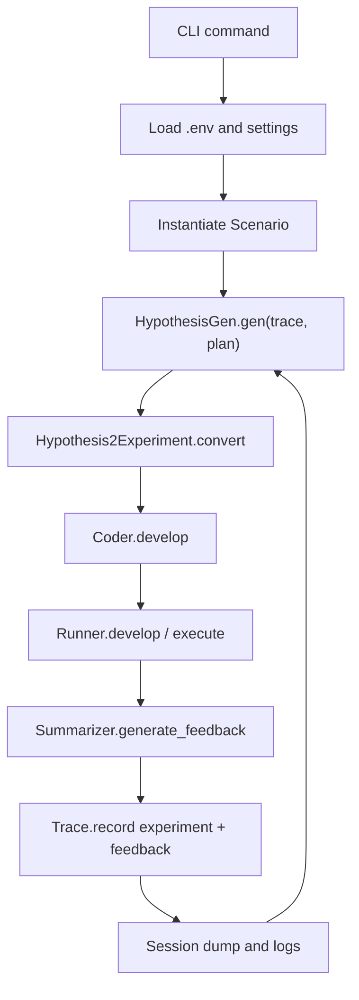

# RD-Agent 架构解析

## 一句话架构

【事实】RD-Agent 的高层架构是：scenario 定义任务场景，proposal 生成 hypothesis 和 experiment，coder/runner 实现并执行 experiment，summarizer 生成 feedback，trace/session/log 保存迭代状态。

## RD-Agent 的本质

【事实】RD-Agent 是项目内置的 agent workflow runtime，而不是单个模型、聊天机器人或 MCP 工具集合。

`runtime` 在这里指运行时底座：它负责把一组规则和模块真正串起来执行，包括启动场景、调用 LLM、生成实验、写代码、跑实验、收集反馈、记录状态和进入下一轮。

| 层级 | RD-Agent 里是谁 | 作用 |
| --- | --- | --- |
| 外部启动者 | 人类用户 / Codex / shell command | 选择命令、提供配置、决定是否批准外部调用。 |
| Workflow runtime | `RDLoop` + `LoopBase` | 控制 propose -> experiment -> coding -> running -> feedback -> record。 |
| 场景规则 | `Scenario`、settings、templates、prompts | 定义 quant、data science、Kaggle、finetune 等不同任务边界。 |
| 技能模块 | `HypothesisGen`、`Hypothesis2Experiment`、`Coder`、`Runner`、`Summarizer` | 类似“内置技能”，但它们是 Python 类和 prompt/code 组合，不是 Codex skill。 |
| 模型后端 | LiteLLM backend | 接 chat model 和 embedding model。 |
| 执行/评估环境 | Docker/Conda、Qlib、Kaggle/local dataset、workspace | 执行生成代码并产出指标、日志、文件。 |
| 记录系统 | `Trace`、logs、`__session__`、workspace | 保存实验轨迹、反馈、session dump 和可回放状态。 |

【推断】因此它最像“把 LLM 放进固定研发流程里的自动实验循环系统”。LLM 负责生成和判断的一部分，runtime 负责让这些生成结果变成可执行、可记录、可迭代的流程。

## 核心模块

| 模块 | 负责什么 | 输入 | 输出 | 状态保存在哪里 | 证据 |
| --- | --- | --- | --- | --- | --- |
| CLI app | 把用户命令路由到 scenario loop。 | CLI args、`.env`。 | 启动对应 loop/UI/health check。 | 无，调用后由 loop/log 管。 | `rdagent/app/cli.py` |
| Scenario | 描述某个 R&D 场景的背景和规则。 | 环境配置、任务上下文。 | 给 proposal/coder/runner 的场景约束。 | loop 对象内。 | `rdagent/core/scenario.py`、scens docs |
| Hypothesis | 表示研究想法和理由。 | trace、plan、历史 feedback。 | hypothesis object。 | trace、logs。 | `rdagent/core/proposal.py` |
| Experiment / Task | 把 hypothesis 变成可实现任务。 | hypothesis、trace。 | experiment with sub_tasks/workspace。 | workspace、trace、session。 | `rdagent/core/experiment.py` |
| Developer / Coder | 写代码或改 workspace。 | experiment。 | updated experiment / code files。 | workspace、logs。 | `rdagent/core/developer.py` |
| Runner | 执行代码、回测或验证。 | coded experiment。 | result / stdout / metrics。 | workspace、logs。 | `rdagent/app/qlib_rd_loop/*.py` |
| Summarizer / Feedback | 评估实验结果，给出 decision/reason。 | result、trace。 | feedback object。 | trace、logs。 | `rdagent/core/proposal.py`、`rdagent/components/workflow/rd_loop.py` |
| Trace | 保存历史 experiment 和 feedback。 | record step。 | `hist`、parent DAG。 | loop object，session dump。 | `rdagent/core/proposal.py` |
| LoopBase | 管理 step、parallel、resume、dump。 | step methods。 | session files。 | `log/<timestamp>/__session__/`。 | `rdagent/utils/workflow/loop.py` |
| UI/log | 展示或保存 R&D process。 | log path、trace storage。 | Streamlit/Web UI、pkl/log。 | `log/<timestamp>/`。 | `docs/ui.rst`、`rdagent/log/` |

## 主要 workflow / data flow

## 关键文件阅读顺序

| 顺序 | 文件 | 为什么读 |
| --- | --- | --- |
| 1 | `README.md` | 先建立作者 intent、scenario 和 quick start。 |
| 2 | `docs/installation_and_configuration.rst` | 明确环境、key、Docker、账号和安全边界。 |
| 3 | `docs/scens/catalog.rst` | 确认项目不是 quant-specific。 |
| 4 | `docs/scens/quant_agent_fin.rst` | 理解 RD-Agent(Q) 官方流程。 |
| 5 | `rdagent/app/cli.py` | 验证官方命令是否有代码入口。 |
| 6 | `rdagent/components/workflow/rd_loop.py` | 理解核心 R&D loop。 |
| 7 | `rdagent/utils/workflow/loop.py` | 理解 session、resume、step control。 |
| 8 | `rdagent/app/qlib_rd_loop/conf.py` | 理解 quant scenario 的模块注入和默认 train/valid/test。 |

## 状态、日志、memory 或持久化

| 类型 | 当前确认 | 说明 |
| --- | --- | --- |
| task / experiment trace | 【事实】`Trace.hist` 保存 `(Experiment, ExperimentFeedback)`。 | 是运行内研究轨迹的核心。 |
| parent DAG | 【事实】`Trace.dag_parent` 保存父节点索引。 | 支持实验谱系，但多 parent 代码注释显示未完全实现。 |
| session resume | 【事实】`LoopBase.dump/load` 会 pickle session。 | 便于从某一步继续或 checkout。 |
| file workspace | 【事实】`FBWorkspace` 创建 `git_ignore_folder/RD-Agent_workspace/<uuid>`。 | 代码和产物以文件形式存在。 |
| log path | 【事实】默认 `log/<timestamp>`。 | UI 读取日志。 |
| knowledge base | 【事实】配置中有 `knowledge_base` 字段，CoSTEER 有 knowledge management 代码。 | 【待验证假设】还需后续验证它是否是 research memory，而不只是 coder failure memory。 |
| failure memory | 【待验证假设】CoSTEER knowledge 代码提到 failed attempts，但本轮不深入。 | 需要 Phase 5 或运行后验证。 |

## 测试、验证和质量控制

| 机制 | 当前观察 | 初步判断 |
| --- | --- | --- |
| Train/valid/test split | quant 配置有默认 2008-2014 train、2015-2016 valid、2017-2020 test。 | 【事实】存在时间段配置；【待验证假设】是否强制严格 OOS 还未验证。 |
| Feedback decision | `ExperimentFeedback` 有 `decision: bool`。 | 【事实】有 accept/reject 表达。 |
| Exception feedback | exception 可转为 negative feedback。 | 【事实】失败能进入 feedback。 |
| Session checkpoint | step 后 dump。 | 【事实】可恢复。 |
| Human interaction | RDLoop 有 `_interact_hypo` 和 `_interact_feedback`。 | 【事实】有 hook；【待验证假设】默认 CLI 是否实际启用人工审批。 |
| UI trace | docs 说可显示 loops/evolving steps。 | 【待验证假设】展示细节需运行验证。 |

## 如果是 AI / agent / quant / backtest 项目

- Research Agent: 【事实】`HypothesisGen` 负责生成 hypothesis；具体实现由 scenario 注入。
- Main Agent / Orchestrator: 【事实】`RDLoop` 和 `LoopBase` 组织步骤、并行、停止和记录。
- Reviewer Agent: 【推断】`summarizer / Experiment2Feedback` 扮演 evaluator/reviewer 角色，但是否独立 agent 取决于 scenario。
- Backtest / Simulation Layer: 【事实】quant scenario 通过 Qlib templates 和 runner 执行。
- Data Layer: 【事实】quant 默认依赖 Qlib local data；data science 依赖 local dataset/Kaggle。
- Memory / Findings / Failures: 【事实】trace/session/log 存在；【待验证假设】长期 research memory 强度未验证。
- Experiment Tracking: 【事实】`log/<timestamp>/__session__`、trace、UI。
- Human Approval Gate: 【事实】有 interactor hook；【待验证假设】不是默认强制审批。
- Anti-overfit / Validation Discipline: 【事实】有 train/valid/test；【待验证假设】rolling/cross-market/ablation 未确认。
- Report / UI / Explanation Layer: 【事实】Streamlit UI 和 web UI 存在；【待验证假设】审计体验未验证。

## 和“只做表达式搜索”项目的本质差异

【推断】RD-Agent 的核心对象更接近 `hypothesis -> experiment -> code/workspace -> result -> feedback -> trace`，不是单纯 expression。这个对象链条是它对自研 AI alpha research system 最值得借鉴的地方。

【待验证假设】对象链条存在不等于研究纪律强制存在。是否能防止 alpha illusion，需要后续检查 metrics、validation、failure reuse 和 human approval。
